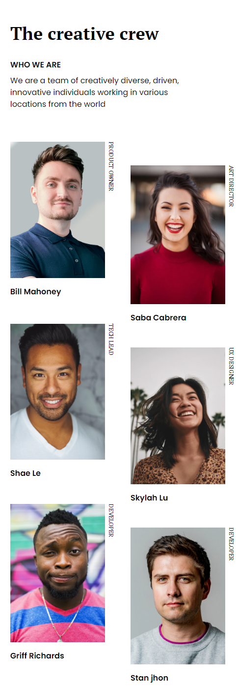
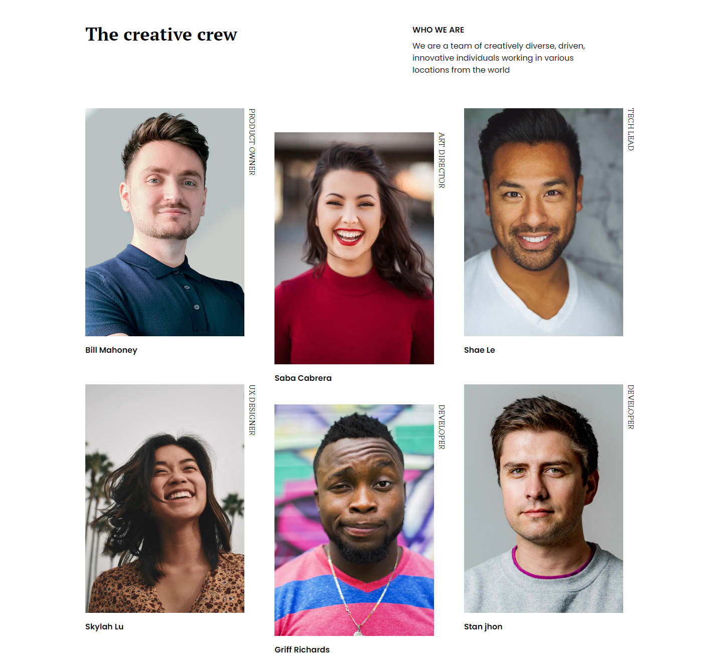

<!-- Please update value in the {}  -->

<h1 align="center">My Team Page</h1>

   Solution for a challenge from  <a href="http://devchallenges.io" target="_blank">Devchallenges.io</a>.

  <h3>
    <a href="https://rc-my-team-master.netlify.app/">
      Demo
    </a>
     | 
    <a href="https://github.com/therahulchaurasia/my-team-page-master">
      Solution
    </a>
     | 
    <a href="https://devchallenges.io/challenges/hhmesazsqgKXrTkYkt0U">
      Challenge
    </a>
  </h3>

<!-- TABLE OF CONTENTS -->

## Table of Contents

- [Overview](#overview)
  - [Built With](#built-with)
- [Features](#features)
- [Contact](#contact)
- [Acknowledgements](#acknowledgements)

<!-- OVERVIEW -->

## Overview

<table>
<tr>
<td><b style="font-size:20px">Mobile</b></td>
<td><b style="font-size:20px">Dektop</b></td>
</tr>
<tr>
<td></td>
<td></td>
</tr>
</table>

Introduce your projects by taking a screenshot or a gif. Try to tell visitors a story about your project by answering:

1. What was your experience?

- I wanted to build a project using Tailwind CSS in order to improve my skills with Tailwind and this project was a good opportunity to use Tailwind.
- I used grid in order to align the images according to the design provided and create a responsive design as well .

2. What have you learned/improved?

- In this project I was able to learn how to use different Tailwind classes and extend the functionalities of Tailwind according to the project's requirement.

3. Your wisdom? :)

- Using Tailwind CSS over normal CSS was a pretty good experience. Tailwind covers a wide variety of classes, which makes it pretty simple to use. The setup for tailwind was a little bit tedious for me, but after setting it up, everything was smooth sailing.

### Built With

<!-- This section should list any major frameworks that you built your project using. Here are a few examples.-->

- [Tailwind](https://tailwindcss.com/)

## Features

<!-- List the features of your application or follow the template. Don't share the figma file here :) -->

This application/site was created as a submission to a [DevChallenges](https://devchallenges.io/challenges) challenge. The [challenge](https://devchallenges.io/challenges/hhmesazsqgKXrTkYkt0U) was to build an application to complete the given user stories.

## Acknowledgements

<!-- This section should list any articles or add-ons/plugins that helps you to complete the project. This is optional but it will help you in the future. For exmpale -->

- [Tailwindlabs](https://github.com/tailwindlabs/tailwindcss/discussions/2494) : Using this I added the dependency for a different writing mode which is required in the project

## Contact

- GitHub [@therahulchaurasia](https://github.com/therahulchaurasia)
